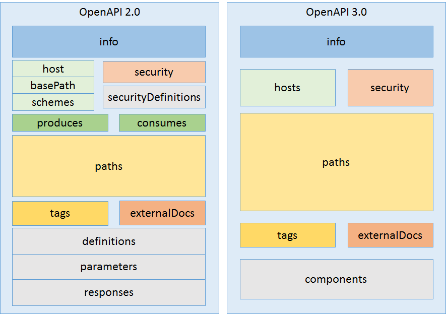

<link rel="stylesheet" href="markdownstyle.css"/>

# 
As promised in the [previous post](https://openapis.org/news/blogs/2016/07/you-can-get-involved-creating-openapi-specification-and-heres-how) that explained the background and organization behind the evolution of the spec, here is the first installment discussing our progress so far.

The issues have been grouped into six omnibus meta-issues:

- Structural improvements
- Request Parameters
- Protocol and Payload
- Documentation
- Security
- Path definitions

Each of these will take at least a blog post to discuss, and we'll tackle them in order. First up…

## Structural improvements
The next version of OpenAPI is planned to be a significant change, in semantic versioning terminology, it is a major change.  This is obviously not something you want to do very often with a specification, so when you do, you need to take the opportunity to do whatever structural changes can help to justify the need for the breaking change.

### New Version Identifier
To recognize the new branding of the OpenAPI spec, the `swagger` property is replaced with an `openapi` version number.  Going forward this [version number](https://github.com/OAI/OpenAPI-Specification/blob/OpenAPI.next/versions/3.0.md#fixed-fields) will follow the conventions of [semantic versioning](http://semver.org/) therefore will have three parts to the number: major.minor.patch.  This should enable more controlled and visible changes to the specification in the future.

### Components Objects
In OpenAPI 2.0 there was some inconsistency in the behavior of root level properties.  Some properties contained metadata that was applied globally to the API, whereas other properties were used as containers for reusable fragments of metadata to be referenced elsewhere.  In order to clarify this, and to minimize the properties in the root, a new `components` property was introduced.  The [components property](https://github.com/OAI/OpenAPI-Specification/blob/OpenAPI.next/versions/3.0.md#componentsObject) contains only reusuable metadata that would be referenced elsewhere in the document.  

The consequence of the changes to top level objects is a much simpler overall documentation structure:

### Multiple Hosts
Currently OpenAPI 2.0 only allows specifying a single `host` and `basepath`.  The `schemes` attribute can specify both `http` and `https` and therefore effective enable two hosts. In OpenAPI.vNext, which will most likely be versioned as 3.0.0, there is a new root level `hosts` object that can hold an array of objects that contain `host`, `basepath` and `scheme` properties.  By structuring this as an array of objects, we are able to support any number of root URLs for the API and it provides a more clear correlation of the scheme, host and basepath property.  It also aids in our effort to reduce the number of root level properties in order to simplify the document structure.

During the discussions of this feature, requests were made to enable these paths to be identified as pointing to different environments, such as *dev*, *test* and *production*, however, that would infer that the different hosts point to different API implementations.  That was not the intent of supporting multiple root URLs for the API.  The intent was to provide a set of aliases for the same API.  There is an open issue to allow parameterization of the host and basepath, which would allow for pointing to different environments.    

Additionally, the `host`, `basePath` and `scheme` can be overriden at the [path item](https://github.com/OAI/OpenAPI-Specification/blob/OpenAPI.next/versions/3.0.md#pathItemObject) level.  This will make it easier to incorporate functionality provided on a separate host into an API description.

### More Description
The updated specification enables users to describe their APIs in a more resource oriented manner.  Previously descriptions of API behavior were defined at the operation level.  For APIs designed in a resource oriented way, documentation text would often read "GET a foo", "POST a foo", "DELETE a foo".  If the purpose of "foo" was elaborated upon, it became necessary to duplicate that text in each operation.  Now a [Path Item object](https://github.com/OAI/OpenAPI-Specification/blob/OpenAPI.next/versions/3.0.md#pathItemObject) can contain both a short `summary` text and a longer `description` text.  The choice to provide additional description at the operation level is left up to the user based on whether further explanation is required.

### Examples object
The options for describing examples have been [significantly expanded](https://github.com/OAI/OpenAPI-Specification/blob/OpenAPI.next/versions/3.0.md#examples-object).  The previous specification indicated that examples could only be described by a JSON or YAML object.  Now, by using a JSON string, any format of example can be described.  Additionally a `$ref` object can be used to point to external files containing examples.
The exact method of structuring examples is still in flux and is dependent on whether the proposed `content` object is accepted by the TDC.  The `content` object contains an array of example objects for defining a one or more examples for each media type.

In the next post we will talk about the changes coming to how requests are described in OpenAPI 3.0.