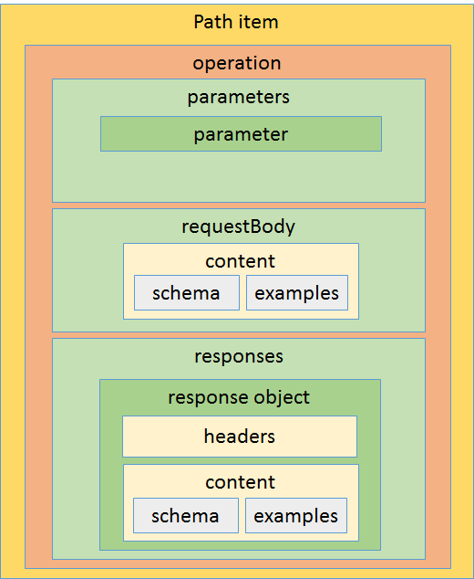

## Request Parameters
In OpenAPI 2.0, all of the varying pieces of the request message, including URL parameters, headers and body were described as a set of typed parameters. Experience has shown that mapping the description of a HTTP request body into the same set of metadata as query and header parameters presents a number of challenges.  A number of changes have been implemented to attempt to address these challenges.

### Request Body
A new property [requestBody](https://github.com/OAI/OpenAPI-Specification/blob/OpenAPI.next/versions/3.0.md#requestBodyObject) has been added to the `operation object`. Creating this distinct property enabled the `parameter object` to be simplified and made it easier to describe the request body.   

### Content Objects
In OpenAPI 2.0 there is a fairly complex relationship between where response media types can be declared and where response schemas and examples can be defined.  Multiple response Media types can be defined globally and overridden at the operation level.  However, only one schema can be defined per response object, but examples can can be defined by media type, and/or one per schema.  This makes it difficult to define different schemas for different media types and use different media types for different response objects.

The [content object](https://github.com/OAI/OpenAPI-Specification/pull/761), alternatively named `representation object`, introduces a simple relationship between response objects, media types and schemas.  Each response object contains a single `content type object` for each supported media type.  Each `content type object` has a single schema and an array of examples for that media type.

The `content object` is also used for the request body and works identically for describing the inbound payload.  The use of content object removes the need for the `produces` and `consumes` arrays.  Discussions are ongoing as to whether to also use content objects to enable describing complex URL parameters and response header values.

These changes result in a path item that has this structure:

### Cookie Parameter
Although TDC members unanimously felt that using cookies was not the preferred approach for passing parameters to an API, it was decided that enough users had expressed the wish to be able to describe existing APIs that used cookies, to warrant the inclusion of a new [parameter type](https://github.com/OAI/OpenAPI-Specification/blob/OpenAPI.next/versions/3.0.md#fixed-fields-9). 

In the next post we will talk about new interaction patterns that we will support and planned changes for payload descriptions.