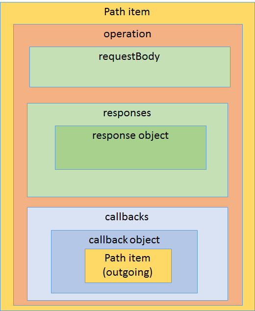
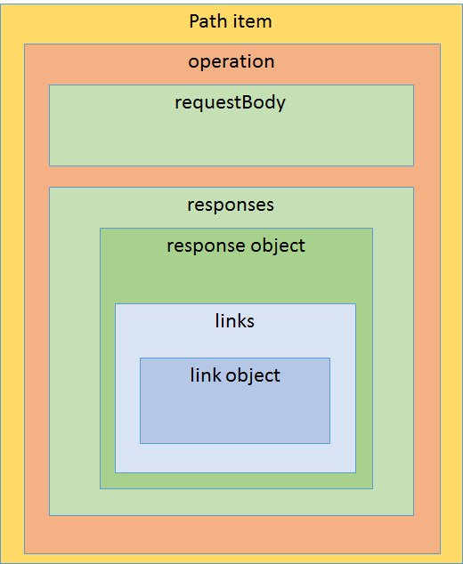

## Protocol and Payload
The primary goal of OpenAPI is to describe standard request/response HTTP APIs.  However, the desire to describe distributed APIs goes further than the simple HTTP model.  There have been numerous requests to support the description of other types of APIs such as WebSockets APIs, RPC APIs, Hypermedia APIs and publish/subscribe APIs.  All of these proposals have been discussed by the TDC and where extensions to the specification can be added without adding complexity to existing use cases and without straying too far from core goals of the specification, features have been added.

### Callbacks
Webhooks are pattern of using HTTP in an publish/subscribe mode that is becoming extremely popular.  It is simple to use and fits nicely into HTTP architecture.  However, OpenAPI had no way of describing an outbound HTTP request and the expected response.  The new `callback object` makes this possible.  A [callback object](https://github.com/OAI/OpenAPI-Specification/pull/763) can be attached to a subscribe operation to describe an outbound operation that a subscriber should support.

### Links
The OpenAPI github repository has many proposals of how it can better support the description of hypermedia APIs.  The problem is, trying to create a static description of resources in a hypermedia API is somewhat counter to the runtime discovery philosophy of hypermedia APIs.  However, being able to describe the relationships between resources in an API is something that can be partially described statically.  The specification introduces the [links object](https://github.com/OAI/OpenAPI-Specification/blob/OpenAPI.next/versions/3.0.md#linksObject) in order to provide a way to describe what new resources can be accessed based on information retreived from an initial resource.  This is not hypermedia in that, the URLs to the new resources are not embedded in the returned payload, but are constructed based on rules defined in Open API specification.  A new expression syntax has been introduced to allow information from a response to be correlated with parameters in the linked operation.

The static description of links between resources should allow the generation of more useful documentation and client libraries that can encapsulate the process of traversing from one resource to another.  This could lead to client libraries that reduce the coupling that client applications have to server defined resource hierarchies.    

### JSON Schema
There has been lots of feedback on providing additional support for some of the more complex features of JSON Schema.  Previously, only features of JSON schema that could be effectively supported by tooling were supported. However, many users have requested more comprehensive support, despite the fact that tooling support for those features may be sub optimal.  It is never easy when making choices like this to know whether it is better give users sharp tools that they may cut themselves with, or rely on experience to say no, users are going to regret it if we enable that.  OpenAPI started with a conservative approach and now its user base is more experienced, it is [lifting some of the restrictions](https://github.com/OAI/OpenAPI-Specification/pull/741) and relying on users making smart choices.

### Alternative Schemas
With the improved support for non-json media types, the limitations of using only JSON schema to describe payloads is becoming more untenable. TDC is currently exploring options of how to enable describing the schemas of non-json payloads.  If this challenge can be overcome, it may become possible to completely remove the form parameter type, and support protocols like gRPC that use protobuf and protobuf schema.  
