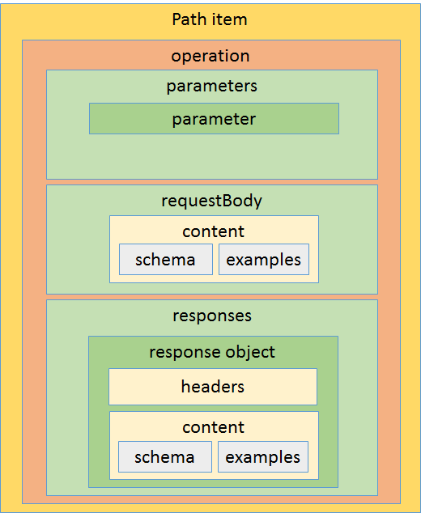

<link rel="stylesheet" href="markdownstyle.css"/>

# OpenAPI 3.0 - The evolution of a success story

OpenAPI is the new name for what was previously referred to as the [Swagger specification](https://github.com/OAI/OpenAPI-Specification/blob/master/versions/2.0.md).  Swagger has been successfully used to design, describe, generate, validate thousands of APIs in companies all around the world. A sure sign of a successful products is that the users want it to do more.  Judging by the Open API github repository, there are many more features users want to see incorporated into the next version of the OpenAPI specification.  Also, experience in creating APIs has identified places where improvements could be made to make it quicker to create, easier to maintain and more expressive to support more common scenarios.

## Moving forward
Earlier this year, the development of the Swagger specification was moved over to the [Open API Initiative](https://openapis.org/), a new group in the [Linux Foundation](https://www.linuxfoundation.org/). As part of this process, a working group called the Techinical Developer Committee(TDC) was formed. The mandate being to respond to all the user feedback and create an updated [OpenAPI specification](https://github.com/OAI/OpenAPI-Specification/blob/OpenAPI.next/versions/3.0.md), that would build on the success of its predecessor.  With many hours of effort from core members of the group, much feedback from the wider community and a number of extensive proposals from member organizations, there has been significant progress made on addressing the requests of the user base.

## Herding Cats
One of the early challenges the group faced was attempting to get a handle on exactly what users were asking for.  Github issues are great for capturing the details a specific problem with a product, but when issues are used for feature requests they can become long and detailed discussions that contains all kinds gems of information in a mountain of words.  Issues created by different users often describe similar features, but from different perspectives and there can be significant overlap.  The first job was to process, filter and organize all the feedback into related groups so that the TDC could discuss the issues, create and review proposals to address the feedback.  

The issues were grouped into large meta issues:

- Structural improvements
- Request Parameters
- Protocol and Payload
- Documentation
- Security
- Path definitions

## Structural improvements
The next version of OpenAPI is planned to be a significant change, in semantic versioning terminology, it is a major change.  This is obviously not something you want to do very often with a specification, so when you do, you need to take the opportunity to do whatever structural changes can help to justify the need for the breaking change.

### New Version Identifier
To recognize the new branding of the OpenAPI spec, the `swagger` property is replaced with an `openapi` version number.  Going forward this [version number](https://github.com/OAI/OpenAPI-Specification/blob/OpenAPI.next/versions/3.0.md#fixed-fields) will follow the conventions of [semantic versioning](http://semver.org/) therefore will have three parts to the number: major.minor.patch.  This should enable more controlled and visible changes to the specification in the future.

### Components Objects
In OpenAPI 2.0 there was some inconsistency in the behavior of root level properties.  Some properties contained metadata that was applied globally to the API, whereas other properties were used as containers for reusable fragments of metadata to be referenced elsewhere.  In order to clarify this, and to minimize the properties in the root, a new `components` property was introduced.  The [components property](https://github.com/OAI/OpenAPI-Specification/blob/OpenAPI.next/versions/3.0.md#componentsObject) contains only reusuable metadata that would be referenced elsewhere in the document.  

The consequence of the changes to top level objects is a much simpler overall documentation structure:

### Multiple Hosts
Currently OpenAPI 2.0 only allows specifying a single `host` and `basepath`.  The `schemes` attribute can specify both `http` and `https` and therefore effective enable two hosts. In OpenAPI.vNext, which will most likely be versioned as 3.0.0, there is a new root level `hosts` object that can hold an array of objects that contain `host`, `basepath` and `scheme` properties.  By structuring this as an array of objects, we are able to support any number of root URLs for the API and it provides a more clear correlation of the scheme, host and basepath property.  It also aids in our effort to reduce the number of root level properties in order to simplify the document structure.       

During the discussions of this feature, requests were made to enable these paths to be identified as pointing to different environments, such as *dev*, *test* and *production*, however, that would infer that the different hosts point to different API implementations.  That was not the intent of supporting multiple root URLs for the API.  The intent was to provide a set of aliases for the same API.  There is an open issue to allow parameterization of the host and basepath, which would allow for pointing to different environments.    

Additionally, the `host`, `basePath` and `scheme` can be overriden at the [path item](https://github.com/OAI/OpenAPI-Specification/blob/OpenAPI.next/versions/3.0.md#pathItemObject) level.  This will make it easier to incorporate functionality provided on a separate host into an API description.

### More Description
The updated specification enables users to describe their APIs in a more resource oriented manner.  Previously descriptions of API behavior were defined at the operation level.  For APIs designed in a resource oriented way, documentation text would often read "GET a foo", "POST a foo", "DELETE a foo".  If the purpose of "foo" was elaborated upon, it became necessary to duplicate that text in each operation.  Now a [Path Item object](https://github.com/OAI/OpenAPI-Specification/blob/OpenAPI.next/versions/3.0.md#pathItemObject) can contain both a short `summary` text and a longer `description` text.  The choice to provide additional description at the operation level is left up to the user based on whether further explanation is required.

### Examples object
The options for describing examples have been [significantly expanded](https://github.com/OAI/OpenAPI-Specification/blob/OpenAPI.next/versions/3.0.md#examples-object).  The previous specification indicated that examples could only be described by a JSON or YAML object.  Now, by using a JSON string, any format of example can be described.  Additionally a `$ref` object can be used to point to external files containing examples.
The exact method of structuring examples is still in flux and is dependent on whether the proposed `content` object is accepted by the TDC.  The `content` object contains an array of example objects for defining a one or more examples for each media type.

## Request Parameters
In OpenAPI 2.0, all of the varying pieces of the request message, including URL parameters, headers and body were described as a set of typed parameters. Experience has shown that mapping the description of a HTTP request body into the same set of metadata as query and header parameters presents a number of challenges.  A number of changes have been implemented to attempt to address these challenges.

### Request Body
A new property [requestBody](https://github.com/OAI/OpenAPI-Specification/blob/OpenAPI.next/versions/3.0.md#requestBodyObject) has been added to the `operation object`. Creating this distinct property enabled the `parameter object` to be simplified and made it easier to describe the request body.   

### Content Objects
In OpenAPI 2.0 there is a fairly complex relationship between where response media types can be declared and where response schemas and examples can be defined.  Multiple response Media types can be defined globally and overridden at the operation level.  However, only one schema can be defined per response object, but examples can can be defined by media type, and/or one per schema.  This makes it difficult to define different schemas for different media types and use different media types for different response objects.

The [content object](https://github.com/OAI/OpenAPI-Specification/pull/761), alternatively named `representation object`, introduces a simple relationship between response objects, media types and schemas.  Each response object contains a single `content type object` for each supported media type.  Each `content type object` has a single schema and an array of examples for that media type.

The `content object` is also used for the request body and works identically for describing the inbound payload.  The use of content object removes the need for the `produces` and `consumes` arrays.  Discussions are ongoing as to whether to also use content objects to enable describing complex URL parameters and response header values.

These changes result in a path item that has this structure:

### Cookie Parameter
Although TDC members unanimously felt that using cookies was not the preferred approach for passing parameters to an API, it was decided that enough users had expressed the wish to be able to describe existing APIs that used cookies, to warrant the inclusion of a new [parameter type](https://github.com/OAI/OpenAPI-Specification/blob/OpenAPI.next/versions/3.0.md#fixed-fields-9). 

## Protocol and Payload
The primary goal of OpenAPI is to describe standard request/response HTTP APIs.  However, the desire to describe distributed APIs goes further than the simple HTTP model.  There have been numerous requests to support the description of other types of APIs such as WebSockets APIs, RPC APIs, Hypermedia APIs and publish/subscribe APIs.  All of these proposals have been discussed by the TDC and where extensions to the specification can be added without adding complexity to existing use cases and without straying too far from core goals of the specification, features have been added.

### Callbacks
Webhooks are pattern of using HTTP in an publish/subscribe mode that is becoming extremely popular.  It is simple to use and fits nicely into HTTP architecture.  However, OpenAPI had no way of describing an outbound HTTP request and the expected response.  The new `callback object` makes this possible.  A [callback object](https://github.com/OAI/OpenAPI-Specification/pull/763) can be attached to a subscribe operation to describe an outbound operation that a subscriber should support.

### Links
The OpenAPI github repository has many proposals of how it can better support the description of hypermedia APIs.  The problem is, trying to create a static description of resources in a hypermedia API is somewhat counter to the runtime discovery philosophy of hypermedia APIs.  However, being able to describe the relationships between resources in an API is something that can be partially described statically.  The specification introduces the [links object](https://github.com/OAI/OpenAPI-Specification/blob/OpenAPI.next/versions/3.0.md#linksObject) in order to provide a way to describe what new resources can be accessed based on information retreived from an initial resource.  This is not hypermedia in that, the URLs to the new resources are not embedded in the returned payload, but are constructed based on rules defined in Open API specification.  A new expression syntax has been introduced to allow information from a response to be correlated with parameters in the linked operation.

The static description of links between resources should allow the generation of more useful documentation and client libraries that can encapsulate the process of traversing from one resource to another.  This could lead to client libraries that reduce the coupling that client applications have to server defined resource hierarchies.    

### JSON Schema
There has been lots of feedback on providing additional support for some of the more complex features of JSON Schema.  Previously, only features of JSON schema that could be effectively supported by tooling were supported. However, many users have requested more comprehensive support, despite the fact that tooling support for those features may be sub optimal.  It is never easy when making choices like this to know whether it is better give users sharp tools that they may cut themselves with, or rely on experience to say no, users are going to regret it if we enable that.  OpenAPI started with a conservative approach and now its user base is more experienced, it is [lifting some of the restrictions](https://github.com/OAI/OpenAPI-Specification/pull/741) and relying on users making smart choices.

### Alternative Schemas
With the improved support for non-json media types, the limitations of using only JSON schema to describe payloads is becoming more untenable. TDC is currently exploring options of how to enable describing the schemas of non-json payloads.  If this challenge can be overcome, it may become possible to completely remove the form parameter type, and support protocols like gRPC that use protobuf and protobuf schema.  

## Documentation
The successful interop of existing tooling based around the previous versions of the OpenAPI specification proves that it was successful in conveying the necessary information to tool builders.  We hope to not only continue that success but with the increased particpation of the members of the TDC and community members, we hope to make the specification even more accessible, clear, precise and unambiguous.

### Table of Contents
Adding a table of contents to the specification will help provide new readers an overview of the document structure and will provide links to quickly reference relevant parts of the specification. This is work that still remains to be done, but its inclusion has been agreed upon. 

### Common Mark
The current specification refers to using Github Markdown for providing rich text descriptions of various API objects.  Unfortunately there is no specification for how exactly Github Markdown works and some of its features only work for content hosted on Github.  In order to enable tooling to be more consistently with their implementation of markdown rendering, the latest OpenAPI specification [has adopted the CommonMark format](https://github.com/OAI/OpenAPI-Specification/pull/720).  It is largely compatible with Github markdown so it should have minimal affect on existing documentation, however, there is a detailed specification that describes exactly how the markdown should behave.  

## Remaining Items
There is still a reasonable amount of work still to do before the TDC will be ready declare this version baked.  You don't get very many opportunities to make the significant level of changes that are being made in this release so it is important not to rush out with something that is not ready. 

### Security
There are a number of outstanding requests regarding the description of API security and hopefully the TDC will be able to address these soon.

### Path Definition
The path object has a key value that defines a set of path segments of the URL that along with the schema, host, basepath and query parameters make up the URL that will map to the contained set of operations. There have been many requests to make various aspects of the URL definition more flexible.  Unfortunately, there is always a cost to the flexilibility.  Usually that cost is increased complexity of tooling, or ambiguity in the instance document.  The working group is currently reviewing the capabilities provided by URI Templates as defined by RFC 6570, to identify what features from that specification can be adopted with the minimum of new issues.  

### Non-Json Data
One fairly significant challenge that remains is how OpenAPI should enable the description of non-JSON data.  Currently the schema language is heavily biased towards describing JSON data.  Some customizations have been introduced to support minimal aspects of other formats, and the proposed removal of the form data parameter has introduced a need to be able to describe the schema of that payload. An open question remains, what is the complexity cost of supporting non-JSON formats and what percentage of APIs does that benefit?     

## Summary 
In the comming months the TDC will continue working with community members to resolve the remaining open issues.  Progress so far suggests that the next version of OpenAPI will be easier to understand, will address more user scenarios and be capable of driving more useful documentation, and more extensive validation, with minimal additional burden on tooling authors. With the formal structure of the Linux foundation, the financial support of member companies and the continued participation of the community, OpenAPI can look forward to an even brighter future.
